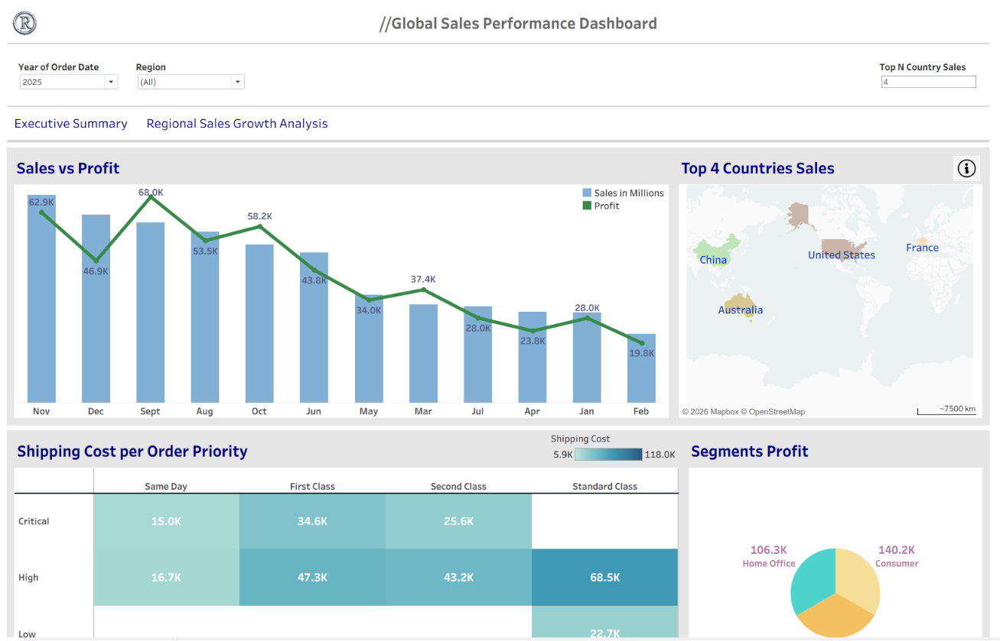
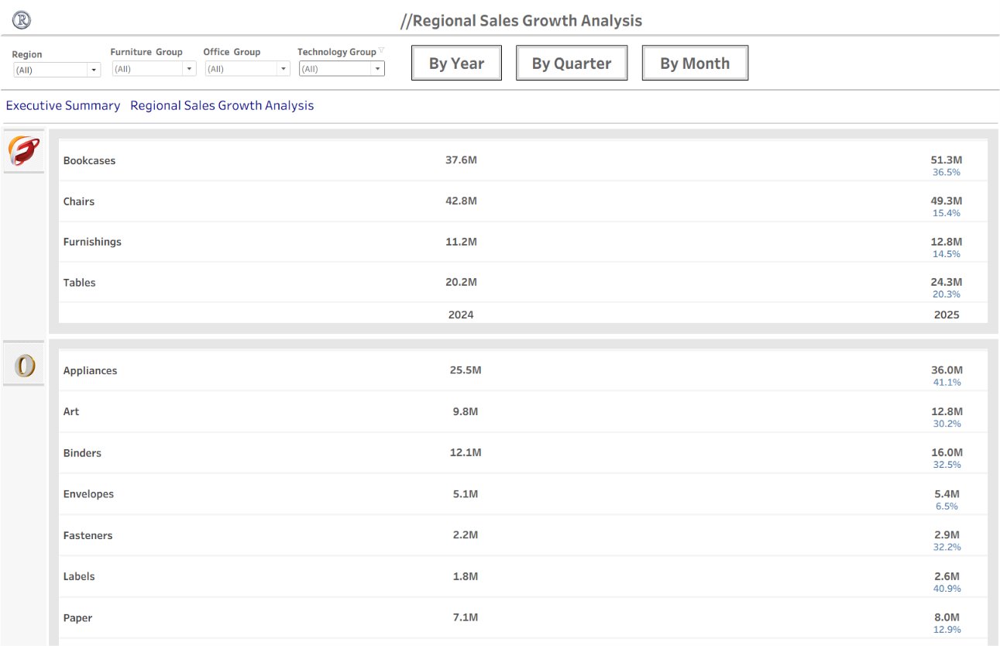

# Retail-Analytics-BI-Dashboard

## Overview
Designed and developed an end-to-end retail analytics solution to analyze sales performance, profitability trends, customer segmentation, and regional growth metrics using Python and Tableau.

The project demonstrates data transformation, KPI reporting, and interactive business intelligence dashboard development for executive-level reporting.

---

## Solution Workflow

Raw Kaggle Dataset  
→ Data Cleaning & Transformation using Python Pandas  
→ Analytical Dataset Preparation  
→ Tableau Dashboard Development  
→ KPI Reporting & Business Insights

---

## Key Features

- Executive KPI Dashboard
- Sales vs Profit Analysis
- Regional Growth Analysis
- YoY / QoQ / MoM Trend Reporting
- Customer Segment Profitability
- Interactive Filters & Navigation
- Top N Analysis

---

## Tools & Technologies

- Tableau
- Python
- Pandas
- Jupyter Notebook
- Microsoft Excel
- Business Intelligence & Data Visualization

---

## Dashboard Screenshots

### Executive Dashboard

---

### Regional Growth Dashboard

---

## Business Insights

- Identified high-performing countries and customer segments
- Analyzed profitability trends across multiple business dimensions
- Evaluated sales growth patterns using YoY, QoQ, and MoM metrics
- Built executive-level KPI reporting dashboards for business monitoring

---

## Related Project

Data cleaning and transformation repository:

[Retail Sales Data Preparation](https://github.com/Himanshu2311garg/Retail-Sales-Data-Preparation)

---

## Files Included

- Tableau Packaged Workbook (`.twbx`)
- Dashboard Screenshots

---

## Author

Himanshu Garg
